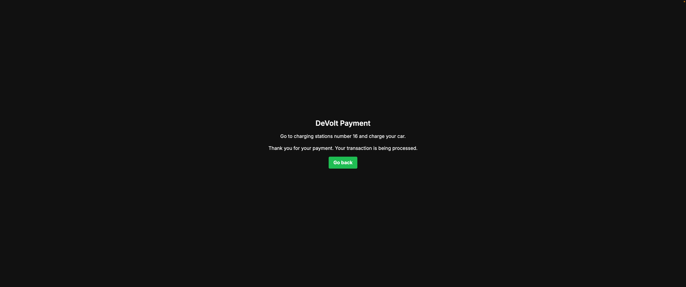

# [Solana Point-Of-Sale Web UI](https://solana-point-of-sale.vercel.app/success)

This project is a simple yet effective Point-Of-Sale (POS) web application that allows users to add products and checkout using Solana Pay. The application demonstrates the integration of Solana Pay for processing payments with Solana blockchain, and it provides a seamless user experience from product selection to payment confirmation.

Link to the live application: [Solana Point-Of-Sale Web UI](https://solana-point-of-sale.vercel.app/success)

## Features

-   **Product Addition**: Users can add products with specified energy amount in kilowatts.
-   **Dynamic QR Code Generation**: For each transaction, a unique QR code is generated that users can scan to make payments via Solana Pay.
-   **Real-time Payment Verification**: After checkout, the application verifies the transaction status in real-time and updates the user interface accordingly.
-   **Success Page**: On successful payment verification, users are redirected to a success page which confirms the transaction and provides additional instructions.

## Prerequisites

-   Node.js (v14 or later)
-   PNPM package manager
-   A Solana wallet with funds (Devnet)

## Installation

1. **Install dependencies**:
    ```bash
    pnpm install
    ```
2. **Set up environment variables**:
   Create a `.env.local` file in the root directory and add your Solana wallet address:
    ```plaintext
    NEXT_PUBLIC_SOLANA_WALLET_ADDRESS=your_wallet_public_key_here
    ```

## Running the Application

1. **Start the development server**:

    ```bash
    pnpm run dev
    ```

2. **Open your browser**:
   Navigate to `http://localhost:3000` to view the application.

## Usage

-   **Add Products**: Enter the amount of kilowatts you wish to purchase and click on "Generate Payment Request".
    
-   **Make Payment**: Scan the QR code generated on the screen with your Solana wallet app.
    
-   **Verify Payment**: The application will automatically verify the transaction. Once verified, you will be redirected to the success page in which you'll be assigned your charging station number.
    
